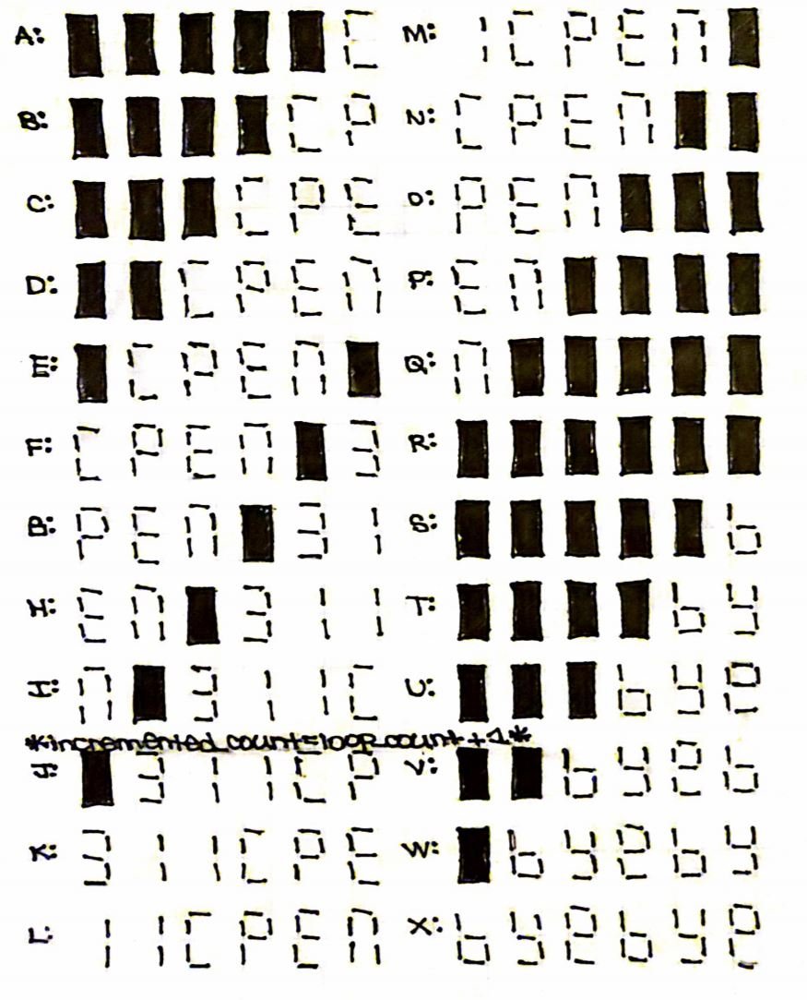
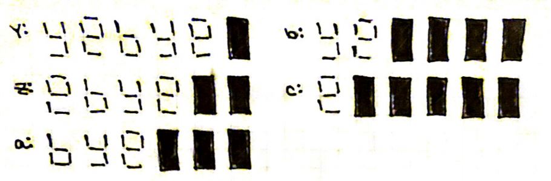
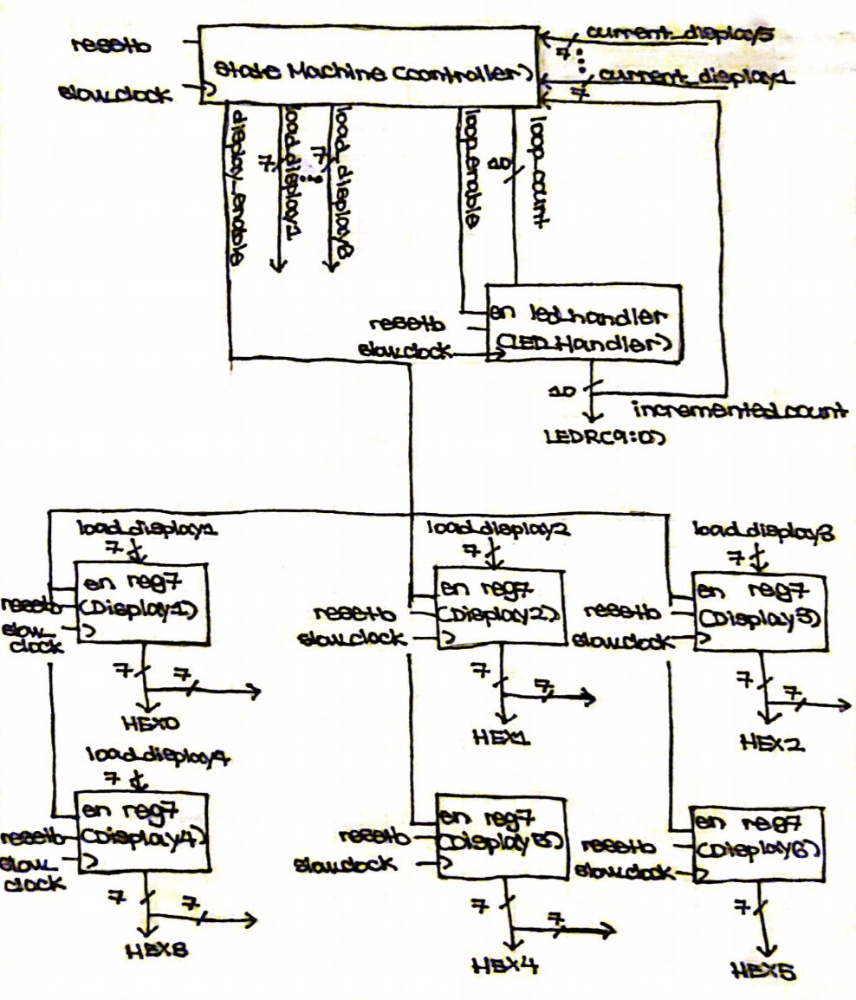
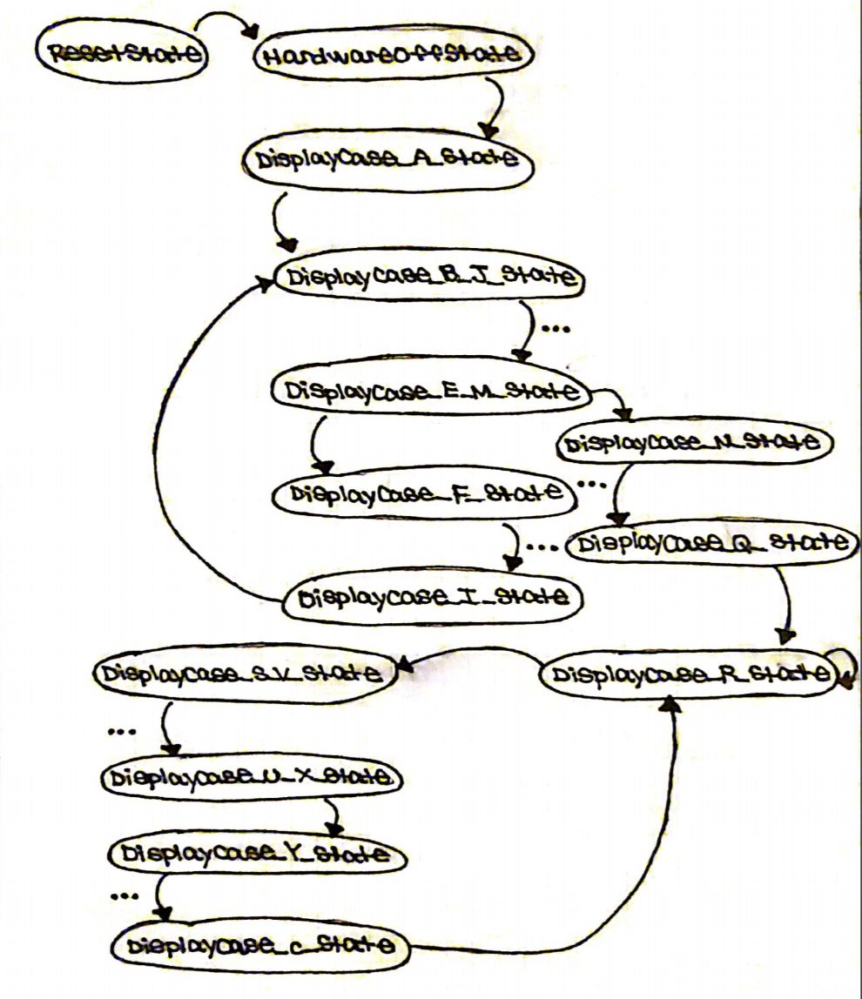
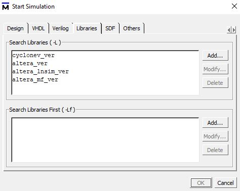

# Simple Datapath and Controller : Scrolling Display "CPEN 311"

## Contents
* [Overview](#Overview)
* [Display Cases](#Display-Cases)
* [Encoding](#Encoding)
* [Circuit](#Circuit)
    * [StateMachine](#StateMachine)
        * [State Transitions](#State-Transitions)
    * [Datapath](#Datapath)
* [Testing](#Testing)
    * [Testbench Design](#Testbench-Design)
        * [Virtual DE1-SoC](#Virtual-DE1-SoC)
        * [Post-Synthesis Simulation](#Post-Synthesis-Simulation)
    * [FPGA Board](#FPGA-Board)
* [Credit](#Credit)

## Overview

A simple digital datapath is implemented using two pieces of Software: <b>Quartus Prime</b>, which is produced by <b>Intel</b>, and <b>ModelSim (Lite Version)</b>, which is produced by <b>Mentor Graphics</b>. Through the use of <b>SystemVerilog</b>, which is a <b>Hardware Description Language (HDL)</b>, this design is loaded onto a <b>DE1-SoC FPGA</b> board.

## Display Cases

These were illustrated prior to the actual design of the circuit in order to be able to create a Finite State Machine (FSM) Controller in the [(`statemachine.sv`)](statemachine.sv) file.

## Encoding

The 7-Segment Display on the De1-SoC is driven by active-low `HEX` outputs (i.e. 0 values turn the segment **ON** and 1 values turn the segment **OFF**.) However, the Loop Count on the `LEDR` outputs are active-high. For our purposes, we will encode this in the LEDR Driver in the [(`driver.sv`)](driver.sv) file as a 10-bit one-hot signal.

| 7-Segment Display | Code |
| ----------------- | ---- |
| C | 7'b1000110 |
| P | 7'b0001100 |
| E | 7'b0000110 |
| n | 7'b1001000 |
| 3 | 7'b0110000 |
| 1 | 7'b1111001 |
| b | 7'b0000011 |
| y | 7'b0010001 |
| e | 7'b0000100 |

## Circuit

Based on previous knowledge of similar digital datapaths, the top level diagram of was created as shown below.

### StateMachine

The controller of the circuit will be transitioning through a series of states. The outputs are dependent on the current state, whereas the next state is determined by the current state, as well as input and outputs.

The current state will be changing on every positive clock edge if the active-high reset signal is asserted (i.e. sequential, synchronous). The outputs and next state are driven by combinational logic and are changed through "blocking" assignments so that they take effect in series.

#### State Transitions

| Current State | Next State | Conditions |
| ------------- | ---------- | ---------- |
| X | ResetState | (resetb == 1) && (posedge clock) |
| ResetState | HardwareOffState | (resetb == 0) && (posedge clock) |
| HardwareOffState | DisplayCase_A_State | (resetb == 0) && (posedge clock) |
| DisplayCase_A_State | DisplayCase_B_J_State | (resetb == 0) && (posedge clock) |
| DisplayCase_B_J_State ... | ... DisplayCase_E_M_State | (resetb == 0) && (posedge clock) |
| DisplayCase_E_M_State | DisplayCase_F_State | (resetb == 0) && (posedge clock) && (LEDR < {10{1'b1}}) |
| DisplayCase_E_M_State | DisplayCase_N_State | (resetb == 0) && (posedge clock) && (LEDR == {10{1'b1}}) |
| DisplayCase_F_State ... | ... DisplayCase_I_State | (resetb == 0) && (posedge clock) |
| DisplayCase_I_State | DisplayCase_B_J_State | (resetb == 0) && (posedge clock) |
| DisplayCase_N_State ... | ... DisplayCase_Q_State | (resetb == 0) && (posedge clock) |
| DisplayCase_Q_State | DisplayCase_R_State | (resetb == 0) && (posedge clock) |
| DisplayCase_R_State | DisplayCase_S_V_State | (resetb == 0) && (posedge clock) && (LEDR != {10{1'b1}}) |
| DisplayCase_R_State | DisplayCase_R_State | (resetb == 0) && (posedge clock) && (LEDR == {10{1'b1}}) |
| DisplayCase_S_V_State ... | ... DisplayCase_U_X_State | (resetb == 0) && (posedge clock) |
| DisplayCase_U_X_State | DisplayCase_Y_State | (resetb == 0) && (posedge clock) |
| DisplayCase_Y_State ... | ... DisplayCase_c_State | (resetb == 0) && (posedge clock) |
| Displaycase_c_State | DisplayCase_R_State | (resetb == 0) && (posedge clock) |

### Datapath

The HEX0 ... HEX5 Displays are instantiated as modified 7-bit registers, which default to turn the respective 7-Segment Display off on active-high reset.
The LEDR Driver is a heavily modified 10-bit register, which increments a 10-bit one hot bus as the message loops through the <b>DE1-SoC FPGA</b>.

There is also a Flickering Light Effect that is implemented on completion of 10 loops around the board.

## Testing

Multiple tests have been implemented to ensure the circuit is functioning exactly as intended. These are evaluated through simulation and loading the design onto the physical <b>DE1-SoC FPGA</b> board.

### Testbench Design

For each of the `.sv` files included in this project, a corresponding testbench was written to cycle the clock and thoroughly evaluate the functioning of the inputs and outputs. Our testbench modules have no input and output ports. They instead instantiate the corresponding synthesizable <b>SystemVerilog</b> module. The testbench drives the clock with the <b>Verilog</b> delay syntax (`#`).

We tried our best to exhaustively test our <b>SystemVerilog Register Transfer Level (RTL)</b> code. To exercise the entire <b>Design Under Test (DUT)</b>, we use the (<b>Verilog</b> `$display`) tasks to check whether our signals are the expected value.

These testbenches were simulated on <b>Modelsim</b> in a very lengthy procedure involving clock-timing to check if the relevant signals are updated on the positive clock edges. These are implemented in the `tb_ ... .sv` files to make debugging the <b>RTL</b> a smoother process.

#### Virtual DE1-SoC

This was developed by <b>The University of British Columbia Electrical and Computer Engineering Department</b> as an emulator. It allows a visual representation of the functionality of the real board (i.e. buttons, LEDs, HEX Displays). More detail is provided in the [`de1-gui`](de1-gui) directory.

For our purposes, we have instantiated this in our [(`tb_toplevel.sv`)](tb_toplevel.sv) file to try our best at manifesting the actual <b>DE1-SoC FPGA</b> board.

#### Post-Synthesis Simulation

The [(`toplevel.vo`)](toplevel.vo) file is generated from the <b>Quartus</b> project compilation in the [(`.../modelsim`)](quartus_simulation/simulation/modelsim) directory.

The `cyclonev_ver`, `altera_ver`, `altera_lnsim_ver`, `altera_mf_ver` are added to <b>Modelsim</b> when simulating [(`tb_toplevel.sv`)](tb_toplevel.sv) to instantiates primitive <b>FPGA</b> modules like `cyclone_lcell_comb` and `cyclone_io_ibuf`.

### FPGA Board

A project is created using <b>Quartus Prime</b> software to load the `.sv` files onto the <b>DE1-SoC FPGA</b> board. The board must be specified in the Project Wizard and the pin assignments must be imported from the [(`DE1_SoC.qsf`)](settings/DE1_SoC.qsf) file and copied into the [(`toplevel.qsf`)](quartus_simulation/toplevel.qsf) file. This step is crucial to avoid damaging the $200 piece of equipment. Following this step, the <i>Start Compilation</i> tool is run over the duration of several minutes. Using the <i>Programmer</i> tool, the design is downloaded onto the <b>DE1-SoC FPGA</b> board via <b>JTAG</b>.

The videos in the [`demonstrations`](demonstrations) directory show the end result of this procedure as well as the output on the <b>DE1-SoC FPGA</b>. This directory is tracked using <b>Git LFS</b> due to size restrictions.</i> We have embedded low resolution compressed versions of these files below.

https://user-images.githubusercontent.com/52113009/115104722-521be480-9f28-11eb-9a4a-4cb7df9ce6c6.mp4

https://user-images.githubusercontent.com/52113009/115104737-665fe180-9f28-11eb-8e3a-fa2748fb1eb1.mp4

## Credit

The idea for this project was derived from <b>The University of British Columbia Electrical and Computer Engineering</b> Undergraduate program. The <b>APSC 160 - Introduction to Computation</b> and <b>CPEN 311 - Digital Systems Design</b> course requirements involve two individual projects which acted as the inspiration for this circuit. A Scrolling 'HELLO' Display originally created using <b>C Programming</b> concepts in <b>APSC 160</b> was redesigned through the use of <b>Digital Design</b> concepts from a Baccarat engine created in <b>CPEN 311</b>.

The project has been heavily refactored from the initial design to make the StateMachine and testbench more seamless. The entire design document is included in the [(`design.pdf`)](design.pdf) file.
