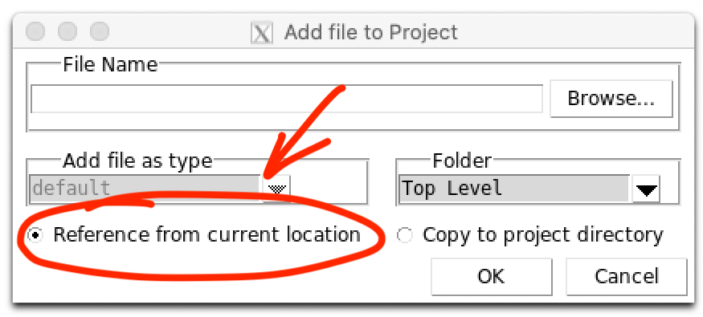
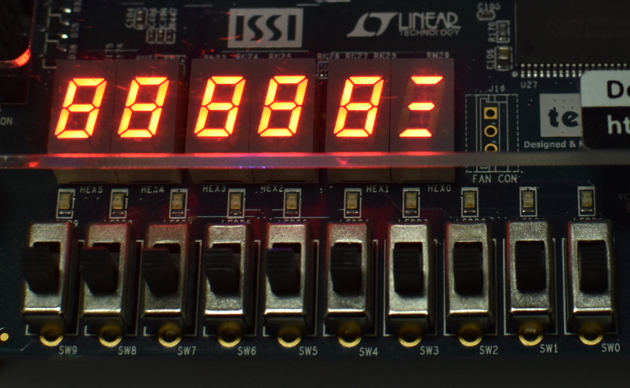

# A Virtual DE1-SoC Board

## Contents

* [Introduction](#introduction)
* [Components](#Components)
* [Setting Up The Simulation](#setting-Up-The-Simulation)
* [Simulating RTL](#simulating-rtl)
* [Simulation Versus The Real Thing™](#Simulation-Versus-The-Real-Thing)

## Introduction

<b>The University of British Columbia Electrical and Computer Engineering Department</b> has developed a “virtual” <b>DE1-SoC</b> that emulates a portion of the functionality of the real board — for our purposes, the buttons, LEDs, and 7-Segment Displays.

## Components

The virtual <b>DE1-SoC</b> consists of two parts:

- a Tcl file (`de1_gui.tcl`) that we need to load in <b>ModelSim</b> before Simulation to implement the <b>GUI</b>, and
- a SystemVerilog file (`de1_gui.sv`) that we need to instantiate in our Testbench to connect to the <b>GUI</b> from our design.

This directory also contains a simple synthesizable design we can use to test that we are using the virtual board correctly (`button_pusher.sv`) and a Testbench that shows how to connect that design to the <b>GUI</b>.

When simulating on <b>Modelsim</b>, these files are not copied to the task folder, but referenced directly from the `de1-gui` folder (<i>“Reference from current location”</i> when we add the file). The `de1_gui.sv` file does not work without the `de1_gui.tcl` interface and it is not synthesizable. 

## Setting Up The Simulation

We launch <b>ModelSim</b> and create our project. We then add `button_pusher.sv`, `de1_gui.sv`, and `tb_de1_gui.sv` to the project. For simplicity, we add files by referencing them in the existing directory rather than copying to the working directory:

We compile the entire design as usual, and load the compiled design by double-clicking on the `tb_de1_gui` in the <b>_Library_</b> tab.

Next, we load the `de1_gui.tcl` via <b>_File&rarr;Load&rarr;Macro&nbsp;File..._</b> or by issuing the `source de1_gui.tcl` command in the <b>Transcript</b> frame. We then see a new window that shows the switches, buttons, LEDs, and 7-Segment Displays of the <b>DE1-SoC</b> board:

All switches and buttons are in the **OFF** position (i.e., the SW signals are all 0, and the KEY signals are all 1 as they are active-low). The LEDs are simulating the dimly-lit state they appear in when they are not driven on the real board.

The fast-forward button  does the same thing as  in <b>ModelSim</b> — it advances the Simulation by the amount of time shown next to  — but saves the need to constantly switch window focus between the <b>DE1-SoC GUI</b> and <b>ModelSim</b>.

Note that unlike on the physical board, buttons stay pushed if we click on them to let us gradually advance the Simulation without holding the mouse button; clicking the buttons again will release them. Because the Hardware design is not being simulated yet, none of the LEDs or 7-Segment Displays will change state.

## Simulating RTL

Now it's time to combine the <b>GUI</b> with simulated Hardware. Add the Testbench signals to a Waveform and simulate for 100ps.

Next, we reset our design. The `button_pusher` design uses `KEY0` as reset, so we click `KEY0` to push it in, advance the Simulation for 100ps, click `KEY0` again to release it, and advance for another 100ps:

We see that the virtual board display has changed:

We have to **manually advance the Simulation** — otherwise the simulated Hardware will not react to our <b>GUI</b> inputs.

## Simulation Versus The Real Thing™

With our physical <b>DE1-SoC</b>, we synthesize `button_pusher` and download it to the <b>FPGA</b>. We include our pin assignments from [(`DE1_SoC.qsf`)](DE1_SoC.qsf) We see that the initial state of the Simulation differs from the real board, which will in all likelihood have the 7-Segment Displays lit:

Once we reset the design using `KEY0`, the two should behave correspondingly. Note that for our Scrolling Display, we have added an additional state in the <b>[Finite State Machine (FSM)](../statemachine.sv)</b> to account for this initial state of the <b>DE1-SoC</b> board.

In our <b>Register Transfer Level (RTL)</b> Simulation, several signals — in particular the `HEX0`...`HEX5` registers that drive the 7-Segment Display drivers — are **_undefined_** (`'x`), and acquire logical 0 or 1 values only after reset. But in the real Hardware, there is no such thing as undefined, so in the Hardware those registers will have some kind of logical value; most likely this is 0, which causes the 7-Segment Displays to light up (as they are active-low). While we cannot rely on this initialization in general, it explains the discrepancy between the Simulation and the Hardware.